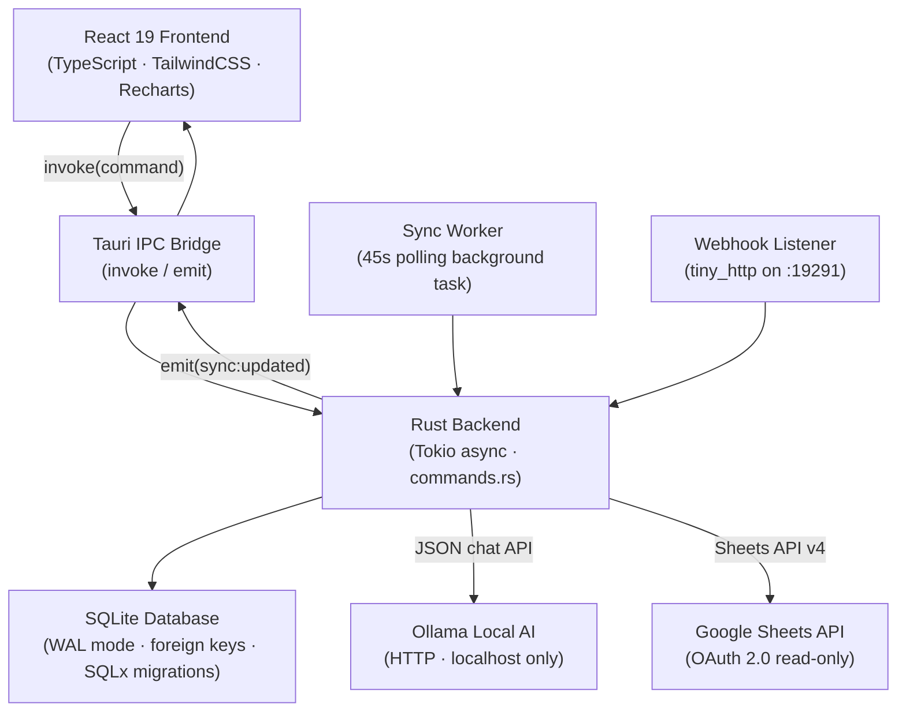
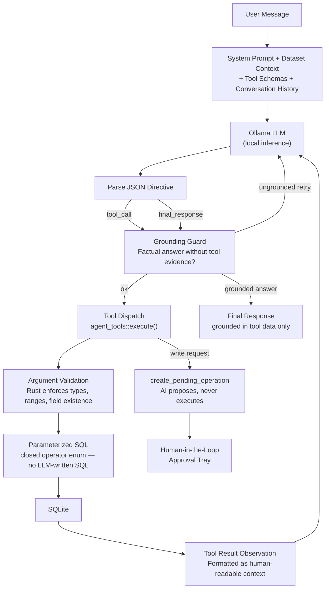
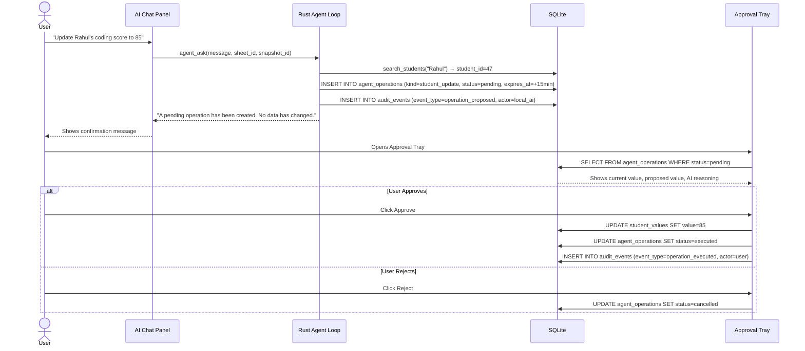
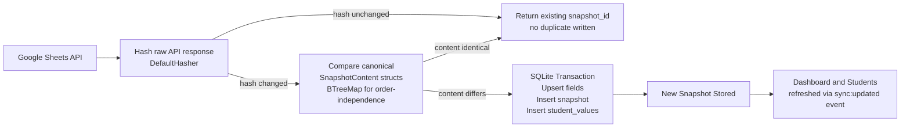

<div align="center">

# ProgressLens

### AI-powered student progress analytics — fully local, privacy-first, desktop-native.

[](LICENSE)
[](https://tauri.app)
[](https://www.rust-lang.org)
[](https://react.dev)
[](https://sqlite.org)
[](https://ollama.com)

</div>

---

## Overview

Academic coordinators, faculty, and mentors spend hours comparing spreadsheet versions to track whether students are improving, stagnating, or falling behind. ProgressLens eliminates that manual work.

**ProgressLens syncs your Google Sheet, stores every sync as a local snapshot, and lets you — or a local AI assistant — query, compare, and act on student progress data without touching a cloud AI service.**

Every student record, every score, every analysis, and every AI conversation stays on your machine. No data is sent to OpenAI, Anthropic, or any remote server.

### Why local-first AI?

- **Privacy** — Student performance data is sensitive. It should not traverse cloud APIs.
- **Compliance** — Many institutions have data-residency requirements that cloud AI cannot satisfy.
- **Cost** — Zero per-query cost. Run thousands of analyses without an API bill.
- **Speed** — No network round-trip to a remote model. Responses come from your local GPU.
- **Ownership** — You control the model, the data, and the infrastructure.

---

## Features

### 🖥️ Desktop Experience

- Native desktop app built with Tauri 2 — no Electron, minimal memory footprint
- Dark-first widescreen UI optimized for analytics workflows
- Works offline after initial Google Sheets sync

### 📊 Analytics Dashboard

- Student health metrics: completion rates, gap counts, score averages
- Level and track distribution charts
- Top performers and risk indicators
- Section-level breakdowns and recent activity feed

### 📸 Snapshot-Based Tracking

- Every sync creates a point-in-time snapshot stored locally in SQLite
- Content-addressable deduplication: identical data never creates a duplicate snapshot
- Compare any two snapshots for field-level diff visualization (added / changed / removed)

### 🤖 Agentic AI Assistant

- Conversational AI interface powered by a local Ollama model (Qwen3, Llama3, Mistral, etc.)
- **ReAct loop architecture** — the model reasons, selects a tool, executes it against your real data, then reasons again before answering
- 8 typed tools: student history, snapshot comparison, declining/improving cohort analysis, dashboard metrics, student search, multi-condition field filtering, and pending operation creation
- All SQL is generated by Rust from a closed enum of validated operators — **the LLM never writes SQL**

### ✅ Human-in-the-Loop

- AI write requests (score updates, flags, notes) are **never executed automatically**
- Every proposed change becomes a `pending_operation` record requiring explicit user approval
- Approval tray shows current value, proposed value, and the AI's reasoning
- Full audit trail stored in SQLite

### 🔒 Privacy by Design

- Ollama endpoint is validated to be `localhost` only — student data cannot leave the device
- Google Sheets access is read-only (`spreadsheets.readonly` OAuth scope)
- OAuth refresh tokens are stored locally in `auth.json` inside the app data directory

### 📄 Reports

- Build print-ready HTML progress reports: select snapshots, students, and fields
- Print or save as PDF via the system print dialog
- Export to `.xlsx` via `rust_xlsxwriter`
- Backend support for exporting to a new Google Sheet

### 🔄 Google Sheets Sync

- Authenticate once with Google OAuth — refresh tokens persist silently
- Background auto-sync polls every 45 seconds and emits a Tauri event when data changes
- Webhook trigger on `POST http://127.0.0.1:19291/sync-trigger` for external automation (e.g., Google Apps Script)
- Hash-based change detection skips snapshot creation when data is unchanged

---

## Architecture



### Layer Explanations

| Layer             | Technology                              | Responsibility                                                                |
| ----------------- | --------------------------------------- | ----------------------------------------------------------------------------- |
| **Frontend**      | React 19, Vite, TypeScript, TailwindCSS | UI, routing, chart rendering, AI chat panel                                   |
| **IPC Bridge**    | Tauri 2 `invoke` / `emit`               | Type-safe serialized calls between webview and Rust                           |
| **Rust Backend**  | Tokio, SQLx, reqwest                    | All business logic, data persistence, OAuth, sync, agent loop                 |
| **Database**      | SQLite (WAL mode)                       | Local persistence: students, fields, snapshots, AI conversations, audit trail |
| **Local AI**      | Ollama HTTP API                         | LLM inference — always localhost, never a remote endpoint                     |
| **Google Sheets** | Sheets API v4, OAuth2                   | Read-only data source — synced into SQLite snapshots                          |
| **Sync Worker**   | Tokio background task                   | Polls sheets on a 45s interval, hash-detects changes                          |
| **Webhook**       | `tiny_http` TCP listener                | External trigger port for automation (e.g., Apps Script push)                 |

---

## Agent Architecture

ProgressLens implements a **ReAct (Reason + Act) agentic loop** entirely in Rust.



### Agent Loop Steps

| Step                    | Description                                                                                                                              |
| ----------------------- | ---------------------------------------------------------------------------------------------------------------------------------------- |
| **System prompt**       | Hard rules (no fabrication, no raw SQL, localhost-only), output format contract, tool selection guide, few-shot examples                 |
| **Dataset context**     | Sheet name, snapshot ID, and every field key + label + type — injected fresh on each request                                             |
| **LLM call**            | Ollama `/api/chat` with `temperature: 0.0` (deterministic), `format: "json"` (structured output)                                         |
| **JSON parse**          | Response is parsed into a `ModelDirective` enum (`ToolCall` or `FinalResponse`)                                                          |
| **Grounding guard**     | If the model attempts a factual final answer without calling any tool first, it is retried with a correction prompt                      |
| **Tool dispatch**       | Tool name is matched against a closed list in Rust — unknown tool names are rejected                                                     |
| **Argument validation** | All arguments are validated in Rust: type checks, length bounds, field key existence in DB                                               |
| **SQL execution**       | Parameterized queries only. For `filter_students_by_field`, operators come from a closed Rust enum — the LLM cannot inject SQL fragments |
| **Observation**         | Tool result is formatted as human-readable text (not raw JSON) to reduce token noise                                                     |
| **Write request**       | Any change request creates a `pending_operation` row — no data is modified                                                               |
| **Final response**      | Must be grounded in tool-returned data. Raw JSON and markdown are stripped before display                                                |

---

## Human-in-the-Loop Workflow



---

## Snapshot Workflow



**Key design decisions:**

- Two-stage deduplication: fast hash check first, then deep structural equality
- `BTreeMap` (sorted) comparison makes row ordering in the sheet irrelevant
- A `Mutex`-guarded save path prevents two concurrent sync triggers from inserting identical content
- All inserts are in a single SQLite transaction — partial failures leave no orphaned data

---

## Tech Stack

| Category               | Technology                                                         |
| ---------------------- | ------------------------------------------------------------------ |
| **Frontend**           | React 19, TypeScript, Vite 7, TailwindCSS 3, React Router 6        |
| **Charts**             | Recharts 3                                                         |
| **Icons**              | Lucide React                                                       |
| **Desktop Runtime**    | Tauri 2                                                            |
| **Backend Language**   | Rust (Edition 2021)                                                |
| **Async Runtime**      | Tokio                                                              |
| **Database**           | SQLite via SQLx 0.8 (WAL mode, typed queries, embedded migrations) |
| **Local AI**           | Ollama (any compatible model: Qwen3, Llama3, Mistral, etc.)        |
| **HTTP Client**        | reqwest 0.12                                                       |
| **Authentication**     | Google OAuth 2.0 via `oauth2` crate                                |
| **Spreadsheet Source** | Google Sheets API v4                                               |
| **Excel Export**       | rust_xlsxwriter                                                    |
| **Webhook Server**     | tiny_http                                                          |
| **Date Utilities**     | date-fns, chrono                                                   |

---

## Installation

### Prerequisites

| Requirement                                                   | Version | Notes                         |
| ------------------------------------------------------------- | ------- | ----------------------------- |
| [Node.js](https://nodejs.org)                                 | 20+     | LTS recommended               |
| [Rust](https://rustup.rs)                                     | stable  | `rustup update stable`        |
| [Tauri prerequisites](https://tauri.app/start/prerequisites/) | —       | Platform-specific system deps |
| [Ollama](https://ollama.com/download)                         | latest  | For the AI assistant feature  |
| Google Cloud project                                          | —       | For Google Sheets sync        |

---

### 1. Clone the Repository

```bash
git clone https://github.com/YOUR_USERNAME/ProgressLens.git
cd ProgressLens
```

### 2. Install Node Dependencies

```bash
npm install
```

### 3. Configure Google OAuth Credentials

ProgressLens reads OAuth credentials from **environment variables at build time**.

**Step 1 — Create a Google Cloud project**

1. Go to [Google Cloud Console](https://console.cloud.google.com)
2. Create a new project (or select an existing one)
3. Enable the **Google Sheets API** under _APIs & Services → Library_

**Step 2 — Create OAuth credentials**

1. Go to _APIs & Services → Credentials_
2. Click **Create Credentials → OAuth 2.0 Client ID**
3. Application type: **Desktop app**
4. Add `http://localhost:8080` as an **Authorized Redirect URI**
5. Note your **Client ID** and **Client Secret**

**Step 3 — Set build-time environment variables**

Edit `src-tauri/.cargo/config.toml` and fill in your credentials:

```toml
[env]
GOOGLE_CLIENT_ID     = "your-client-id.apps.googleusercontent.com"
GOOGLE_CLIENT_SECRET = "GOCSPX-your-client-secret"
```

> `src-tauri/.cargo/config.toml` is listed in `.gitignore` — your credentials stay local.

---

### 4. Install and Configure Ollama _(Optional — AI Assistant)_

```bash
# Pull a recommended model (8B fits comfortably on 8GB VRAM)
ollama pull qwen3:8b

# Verify Ollama is running
ollama list
```

Ollama must be running when you launch ProgressLens. The AI Settings panel lets you configure the endpoint (default `http://localhost:11434`) and model name.

> ProgressLens enforces that the Ollama endpoint is always `localhost`. This is a deliberate
> privacy boundary — student data cannot be sent to any remote AI service.

---

### 5. Run in Development Mode

```bash
npm run tauri dev
```

### 6. Build for Production

```bash
npm run tauri build
```

The packaged installer will be in `src-tauri/target/release/bundle/`.

---

## Screenshots

> Screenshots coming soon.

| Screen                  | Description                                                                                  |
| ----------------------- | -------------------------------------------------------------------------------------------- |
| **Dashboard**           | Academic command center — health metrics, level distribution, recent changes, top performers |
| **Students**            | Filterable student workspace — status badges, multi-field filters, column controls           |
| **AI Assistant**        | Conversational analytics — natural language queries powered by local Ollama model            |
| **Approval Tray**       | Human-in-the-loop — review, approve, or reject AI-proposed changes                           |
| **Snapshot Comparison** | Point-in-time diff — field-level changes per student across any two syncs                    |

---

## Project Structure

```
ProgressLens/
├── src/                        React frontend
│   ├── api.ts                  Typed Tauri invoke() wrappers
│   ├── types.ts                Shared TypeScript types
│   ├── components/
│   │   ├── AssistantPanel.tsx  AI chat interface + approval tray
│   │   └── Layout.tsx          App shell, navigation, sidebar
│   └── pages/
│       ├── Dashboard.tsx       Analytics command center
│       ├── Students.tsx        Filterable student explorer
│       ├── Diff.tsx            Snapshot comparison view
│       ├── Report.tsx          Report builder
│       └── FieldSetup.tsx      Column type configuration
├── src-tauri/
│   ├── migrations/             SQLx embedded SQL migrations (0001–0008)
│   └── src/
│       ├── agent.rs            ReAct agentic loop, conversation management
│       ├── agent_tools.rs      Tool definitions, dispatch, SQL execution
│       ├── auth.rs             Google OAuth2 flow + refresh token persistence
│       ├── commands.rs         Tauri invoke command handlers
│       ├── db.rs               SQLite connection pool + migration runner
│       ├── diff.rs             Snapshot diff computation
│       ├── export.rs           Excel + Google Sheets export
│       ├── lib.rs              Tauri app entry point
│       ├── models.rs           Serde-serializable data types
│       ├── ollama.rs           Ollama HTTP client + localhost enforcement
│       ├── operations.rs       Pending operation helpers
│       ├── sheets.rs           Google Sheets API fetch + parse
│       ├── snapshot.rs         Content-addressable snapshot persistence
│       ├── sync_worker.rs      Background 45s polling task
│       └── webhook.rs          Local sync trigger HTTP listener
└── docs/                       Extended documentation
    ├── architecture.md
    ├── agent.md
    ├── database.md
    ├── snapshot-system.md
    ├── tool-calling.md
    └── security.md
```

---

## License

[MIT](LICENSE) — © 2024 ProgressLens Contributors
