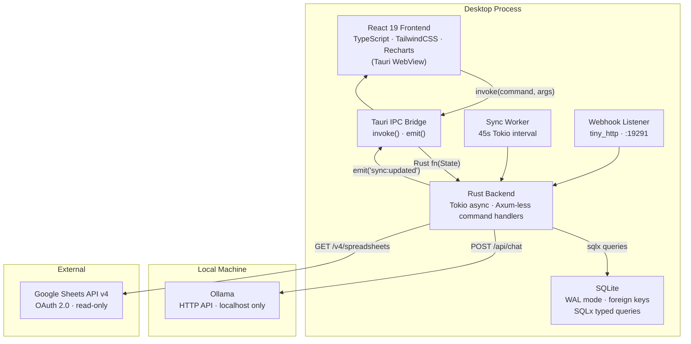
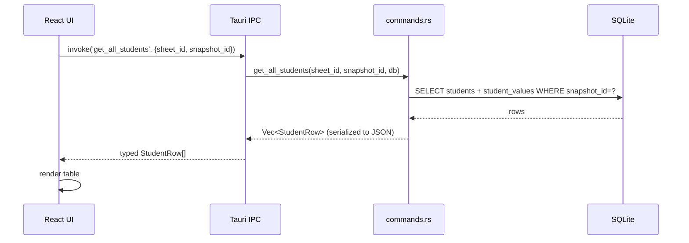
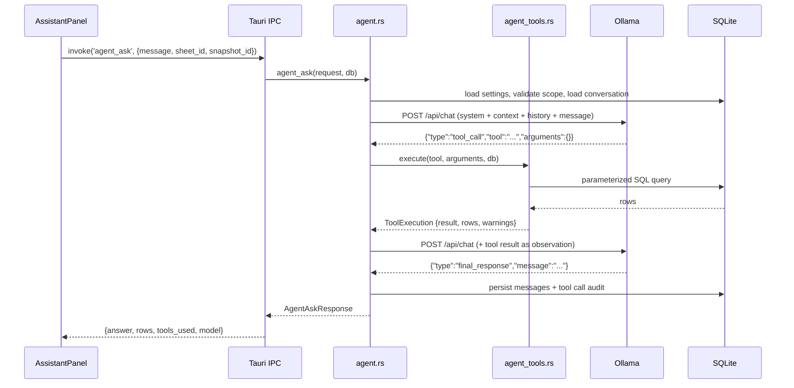

# Architecture

ProgressLens is a local-first desktop application built on Tauri 2. It has five distinct
layers — React frontend, Tauri IPC bridge, Rust async backend, SQLite database, and external
services (Ollama and Google Sheets). Data flows are strictly controlled: the LLM is
localhost-only and Google Sheets is read-only.

---

## High-Level Diagram



---

## Component Responsibilities

### Frontend (`src/`)

| File | Responsibility |
|---|---|
| `api.ts` | Typed `invoke()` wrappers — one function per Tauri command, return types match Rust structs |
| `types.ts` | TypeScript mirror of `models.rs` — kept in sync manually |
| `components/Layout.tsx` | App shell: sidebar navigation, sync status indicator, page routing |
| `components/AssistantPanel.tsx` | AI chat UI, message history, approval tray for pending operations |
| `pages/Dashboard.tsx` | Analytics overview: charts, health cards, recent changes |
| `pages/Students.tsx` | Filterable student table: multi-field filters, column visibility, snapshot selector |
| `pages/Diff.tsx` | Snapshot comparison: student-level diffs with field-by-field old/new display |
| `pages/Report.tsx` | Report builder: student + field + snapshot selection, HTML preview, print/export |
| `pages/FieldSetup.tsx` | Column configuration: data_type, display_name, max_value, visibility |

The frontend never queries SQLite directly. All data access goes through `api.ts` → Tauri IPC → Rust.

---

### Tauri IPC Bridge

Tauri's `invoke()` / `emit()` system serializes arguments to JSON, crosses the WebView boundary,
and deserializes them into typed Rust structs. The return value follows the same path in reverse.

- **`invoke(command, args)`** — synchronous-from-frontend, async in Rust
- **`emit('sync:updated', ())`** — Rust pushes events to the frontend; the React app
  re-fetches data on receipt

All Tauri commands are registered in `lib.rs` via `tauri::generate_handler![]`.

---

### Rust Backend (`src-tauri/src/`)

| Module | Responsibility |
|---|---|
| `lib.rs` | App entry point: DB init, managed state registration, sync worker and webhook spawning |
| `commands.rs` | All `#[tauri::command]` handlers: sync, students, snapshots, dashboard, reports, diff, fields |
| `agent.rs` | ReAct agentic loop: conversation management, grounding guard, tool dispatch orchestration |
| `agent_tools.rs` | Tool implementations: SQL queries, argument validation, result formatting |
| `auth.rs` | Google OAuth2 flow: browser-based initial consent, refresh-token persistence, silent renewal |
| `db.rs` | SQLite pool initialization, WAL-mode config, migration runner |
| `diff.rs` | Snapshot diff algorithm: computes per-student, per-field changes between two snapshots |
| `export.rs` | Excel export (`rust_xlsxwriter`), Google Sheets export |
| `models.rs` | Serde-serializable structs shared between commands and the frontend |
| `ollama.rs` | Ollama HTTP client: chat API, health check, localhost enforcement |
| `operations.rs` | Pending operation helpers: approval, rejection, expiry |
| `sheets.rs` | Google Sheets API v4 fetch and parse logic |
| `snapshot.rs` | Content-addressable snapshot save with deduplication |
| `sync_worker.rs` | Background 45-second polling task |
| `webhook.rs` | tiny_http listener on `:19291` for external sync triggers |

---

### SQLite Database

SQLite runs in **WAL (Write-Ahead Logging)** mode with foreign keys enforced. The database
file lives in the OS app-local data directory, resolved at runtime by Tauri:

- **Windows:** `%LOCALAPPDATA%\com.progresslens.dev\progress_lens.db`
- **macOS:** `~/Library/Application Support/com.progresslens.dev/progress_lens.db`
- **Linux:** `~/.local/share/com.progresslens.dev/progress_lens.db`

Schema is managed via 8 numbered SQLx migrations embedded in the binary. See
[database.md](database.md) for the full schema.

---

### Sync Worker

```
spawn_auto_sync()
    → Tokio interval (45s)
    → try_sync_if_changed()
        → fetch all sheets from DB
        → for each sheet:
            → fetch raw JSON from Google Sheets API
            → hash the response body (DefaultHasher)
            → if hash matches last known: skip
            → else: parse + save_snapshot()
        → if any snapshot created: emit('sync:updated')
```

The hash check is a cheap first gate. The snapshot save has a second, deeper
content-equality check (see [snapshot-system.md](snapshot-system.md)).

---

### Webhook Listener

A `tiny_http` server binds to `127.0.0.1:19291` on startup. Any `POST /sync-trigger`
request causes an immediate force sync. This is useful for Google Apps Script triggers:

```javascript
// In Google Apps Script — fires after sheet edits
function onEdit() {
  UrlFetchApp.fetch('http://127.0.0.1:19291/sync-trigger', { method: 'post' });
}
```

A debounce guard prevents multiple triggers within a 10-second window from
creating excessive API calls.

---

## Data Flow: Typical User Action



---

## Data Flow: AI Agent Request

See [agent.md](agent.md) for the full agent architecture.


