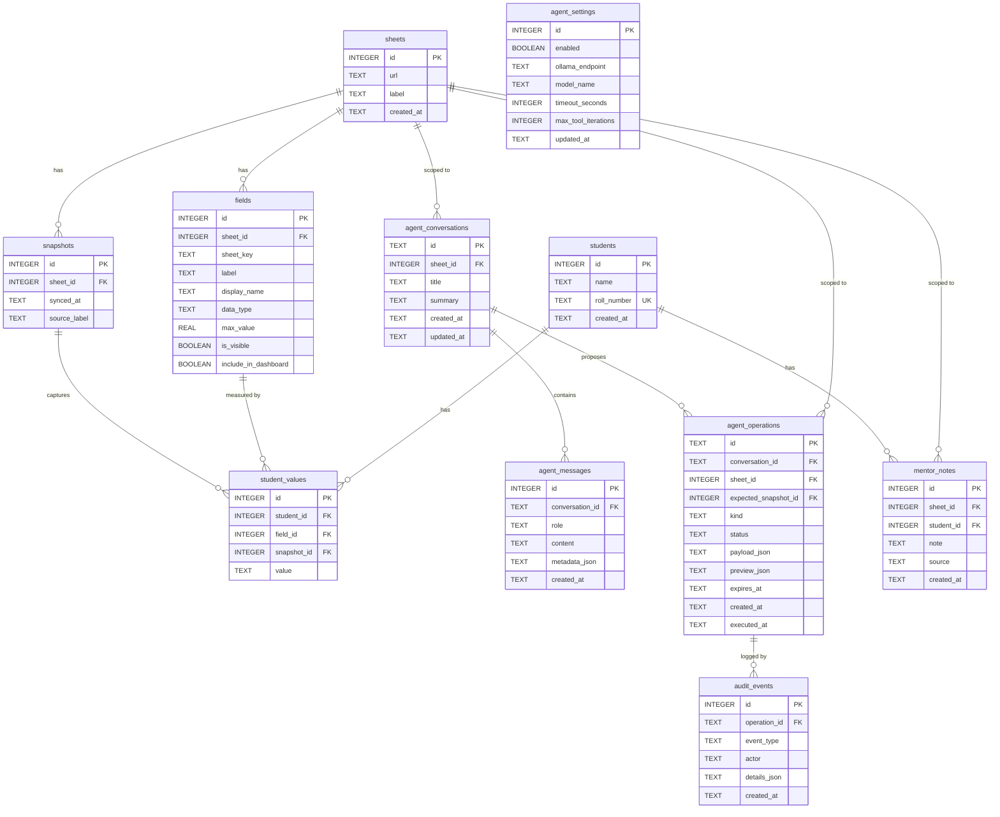

# Database

ProgressLens uses SQLite in WAL (Write-Ahead Logging) mode with foreign key enforcement.
The database is managed by [SQLx](https://github.com/launchbadge/sqlx) with embedded
migrations and compile-time query verification.

---

## Location

The database file is resolved at runtime via Tauri's `app_local_data_dir()`:

| Platform | Path |
|---|---|
| Windows | `%LOCALAPPDATA%\com.progresslens.dev\progress_lens.db` |
| macOS | `~/Library/Application Support/com.progresslens.dev/progress_lens.db` |
| Linux | `~/.local/share/com.progresslens.dev/progress_lens.db` |

---

## Entity-Relationship Diagram



---

## Core Data Tables

### `sheets`
Linked Google Sheets. Each sheet is an independent data source.

```sql
CREATE TABLE sheets (
    id         INTEGER PRIMARY KEY AUTOINCREMENT,
    url        TEXT    NOT NULL UNIQUE,  -- Google Sheets URL or mock identifier
    label      TEXT    NOT NULL,         -- User-facing name for this dataset
    created_at TEXT    NOT NULL DEFAULT (datetime('now'))
);
```

### `students`
Student identity registry. Students are deduplicated by `roll_number` across syncs.

```sql
CREATE TABLE students (
    id          INTEGER PRIMARY KEY AUTOINCREMENT,
    name        TEXT    NOT NULL,
    roll_number TEXT    NOT NULL UNIQUE,  -- Primary identity key
    created_at  TEXT    NOT NULL DEFAULT (datetime('now'))
);
```

### `fields`
Column definitions discovered from the Google Sheet. One row per unique column per sheet.

```sql
CREATE TABLE fields (
    id                   INTEGER PRIMARY KEY AUTOINCREMENT,
    sheet_id             INTEGER NOT NULL REFERENCES sheets(id) ON DELETE CASCADE,
    sheet_key            TEXT    NOT NULL,       -- Normalized column key, e.g. "coding_score"
    label                TEXT    NOT NULL,       -- Original header label from the sheet
    display_name         TEXT,                   -- User-configured display name
    data_type            TEXT,                   -- 'score' | 'level' | 'categorical' | 'text' | 'link' | 'identifier'
    max_value            REAL,                   -- For score fields: maximum possible value
    is_visible           INTEGER NOT NULL DEFAULT 1,
    include_in_dashboard INTEGER NOT NULL DEFAULT 0,
    UNIQUE (sheet_id, sheet_key)
);
```

**Data type semantics:**

| `data_type` | Meaning | Agent tool usage |
|---|---|---|
| `score` | Numeric score (e.g. marks out of 100) | Used in average calculations, trend analysis |
| `level` | Discrete level value (e.g. "1", "2", "3") | Used in distribution charts |
| `categorical` | Enum-like text (e.g. section "A", "B") | Filter by equality |
| `text` | Free-form text or notes | Display only |
| `link` | URL (submission link, etc.) | Display only |
| `identifier` | Roll number, USN, etc. | Identity key — excluded from analytics |

### `snapshots`
Each successful sync that produces new data creates one snapshot row.

```sql
CREATE TABLE snapshots (
    id           INTEGER PRIMARY KEY AUTOINCREMENT,
    sheet_id     INTEGER NOT NULL REFERENCES sheets(id) ON DELETE CASCADE,
    synced_at    TEXT    NOT NULL DEFAULT (datetime('now')),
    source_label TEXT    NOT NULL   -- e.g. "Sheet: SEM 5 Section B"
);
```

### `student_values`
The core data table. One row per `(student × field × snapshot)` combination.

```sql
CREATE TABLE student_values (
    id          INTEGER PRIMARY KEY AUTOINCREMENT,
    student_id  INTEGER NOT NULL REFERENCES students(id)  ON DELETE CASCADE,
    field_id    INTEGER NOT NULL REFERENCES fields(id)    ON DELETE CASCADE,
    snapshot_id INTEGER NOT NULL REFERENCES snapshots(id) ON DELETE CASCADE,
    value       TEXT    NOT NULL DEFAULT '',
    UNIQUE (student_id, field_id, snapshot_id)
);
```

This EAV (Entity-Attribute-Value) design allows any number of dynamic columns from the
sheet without schema changes. Queries join `student_values → fields → students` to
reconstruct flat rows.

**Indexes:**
```sql
CREATE INDEX idx_sv_snapshot ON student_values(snapshot_id);
CREATE INDEX idx_sv_student  ON student_values(student_id);
CREATE INDEX idx_sv_field    ON student_values(field_id);
```

---

## Agent Tables

### `agent_conversations`
Groups messages into conversation sessions, scoped to a single sheet.

```sql
CREATE TABLE agent_conversations (
    id         TEXT    PRIMARY KEY,  -- "conv_<timestamp_nanos>"
    sheet_id   INTEGER NOT NULL REFERENCES sheets(id) ON DELETE CASCADE,
    title      TEXT    NOT NULL DEFAULT 'New conversation',
    summary    TEXT,
    created_at TEXT    NOT NULL DEFAULT (datetime('now')),
    updated_at TEXT    NOT NULL DEFAULT (datetime('now'))
);
```

Conversations are scoped to one sheet. If a user switches sheets and tries to continue
a conversation from another sheet, the agent returns `AI_SCOPE_ERROR`.

### `agent_messages`
Immutable message log. Stores user, assistant, and tool messages.

```sql
CREATE TABLE agent_messages (
    id              INTEGER PRIMARY KEY AUTOINCREMENT,
    conversation_id TEXT    NOT NULL REFERENCES agent_conversations(id) ON DELETE CASCADE,
    role            TEXT    NOT NULL CHECK (role IN ('user', 'assistant', 'tool')),
    content         TEXT    NOT NULL,
    metadata_json   TEXT,   -- JSON: tools_used[], model, tool name + result for tool rows
    created_at      TEXT    NOT NULL DEFAULT (datetime('now'))
);
```

### `agent_operations`
Pending, approved, rejected, or expired AI-proposed data changes.

```sql
CREATE TABLE agent_operations (
    id                   TEXT    PRIMARY KEY,  -- "op_<timestamp_nanos>"
    conversation_id      TEXT    REFERENCES agent_conversations(id) ON DELETE SET NULL,
    sheet_id             INTEGER NOT NULL REFERENCES sheets(id) ON DELETE CASCADE,
    expected_snapshot_id INTEGER REFERENCES snapshots(id) ON DELETE SET NULL,
    kind                 TEXT    NOT NULL,  -- 'student_update' | 'mentor_note' | 'intervention' | 'other'
    status               TEXT    NOT NULL CHECK (status IN ('pending','confirmed','executed','cancelled','expired','failed')),
    payload_json         TEXT    NOT NULL,  -- Full change specification
    preview_json         TEXT    NOT NULL,  -- Human-readable preview for the approval tray
    expires_at           TEXT    NOT NULL,  -- datetime('now', '+15 minutes') at creation
    created_at           TEXT    NOT NULL DEFAULT (datetime('now')),
    executed_at          TEXT
);
```

### `audit_events`
Append-only log of all operation lifecycle events.

```sql
CREATE TABLE audit_events (
    id           INTEGER PRIMARY KEY AUTOINCREMENT,
    operation_id TEXT    REFERENCES agent_operations(id) ON DELETE SET NULL,
    event_type   TEXT    NOT NULL,  -- 'operation_proposed' | 'operation_executed' | 'operation_cancelled'
    actor        TEXT    NOT NULL,  -- 'local_ai' | 'user'
    details_json TEXT    NOT NULL,
    created_at   TEXT    NOT NULL DEFAULT (datetime('now'))
);
```

### `agent_settings`
Single-row configuration table for the AI assistant (row `id = 1`).

```sql
CREATE TABLE agent_settings (
    id                  INTEGER PRIMARY KEY DEFAULT 1 CHECK (id = 1),
    enabled             INTEGER NOT NULL DEFAULT 1,
    ollama_endpoint     TEXT    NOT NULL DEFAULT 'http://localhost:11434',
    model_name          TEXT    NOT NULL DEFAULT 'qwen3:8b',
    timeout_seconds     INTEGER NOT NULL DEFAULT 90,
    max_tool_iterations INTEGER NOT NULL DEFAULT 6,
    updated_at          TEXT    NOT NULL DEFAULT (datetime('now'))
);
```

---

## Migration Strategy

Migrations are numbered SQL files in `src-tauri/migrations/` and embedded into the binary
via `sqlx::migrate!("./migrations")`. They run on startup before the app accepts commands.

| Migration | Description |
|---|---|
| `0001_initial.sql` | Core schema: students, fields, snapshots, student_values |
| `0002_add_sheets.sql` | Add sheets table, add sheet_id FK to snapshots and fields |
| `0003_fields_setup.sql` | Add display_name, max_value, is_visible, include_in_dashboard to fields |
| `0004_add_field_settings.sql` | Additional field configuration columns |
| `0005_agent_foundation.sql` | Agent tables: conversations, messages, operations, audit_events, notes, interventions |
| `0006_local_ai_settings.sql` | agent_settings table |
| `0007_agent_reasoning_defaults.sql` | Default values for agent reasoning parameters |
| `0008_prune_duplicate_snapshots.sql` | One-time cleanup of duplicate snapshots from an earlier bug |

Migrations are idempotent (`CREATE TABLE IF NOT EXISTS`). SQLx tracks applied migrations
in its own `_sqlx_migrations` table.

---

## Useful Queries

```sql
-- All snapshots for a sheet, newest first
SELECT id, synced_at, source_label FROM snapshots
WHERE sheet_id = ? ORDER BY id DESC;

-- Flat student view for a snapshot
SELECT s.name, s.roll_number, f.display_name, sv.value
FROM student_values sv
JOIN students s ON s.id = sv.student_id
JOIN fields f ON f.id = sv.field_id
WHERE sv.snapshot_id = ? AND f.sheet_id = ? AND f.is_visible = 1
ORDER BY s.roll_number, f.id;

-- Score averages per field for a snapshot
SELECT COALESCE(f.display_name, f.label), AVG(CAST(sv.value AS REAL))
FROM student_values sv JOIN fields f ON f.id = sv.field_id
WHERE sv.snapshot_id = ? AND f.data_type = 'score' AND trim(sv.value) != ''
GROUP BY f.id;

-- Pending AI operations for a sheet
SELECT id, kind, preview_json, expires_at FROM agent_operations
WHERE sheet_id = ? AND status = 'pending' AND expires_at > datetime('now')
ORDER BY created_at DESC;
```
