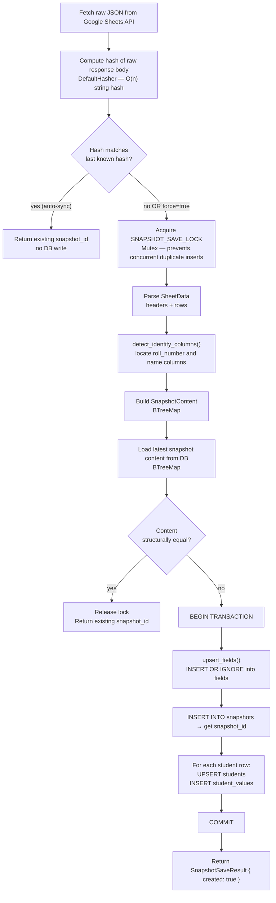

# Snapshot System

ProgressLens stores student data as **point-in-time snapshots**. Every sync that produces
changed data creates a new snapshot; repeated syncs with identical data are silently skipped.
This gives users a reliable history to compare against without accumulating junk snapshots.

---

## Overview



---

## Two-Stage Deduplication

### Stage 1 — Hash Check (Fast Path)

In `sync_worker.rs`, after fetching the raw API response body:

```rust
let new_hash = hash_string(&raw_body);
let last = *sync_state.last_hash.lock().await;
if last != 0 && last == new_hash {
    // skip — response body hasn't changed
    continue;
}
```

This is a cheap in-memory comparison using `DefaultHasher`. It catches the common case
where the sheet hasn't been edited since the last poll and avoids unnecessary DB work.

**Limitation:** The hash is per-process and resets on app restart. After a restart, the
first sync always proceeds to Stage 2.

### Stage 2 — Structural Equality Check (Deep Path)

In `snapshot.rs`, after acquiring the mutex:

```rust
let incoming = incoming_content(data, roll_number_key, name_key);
if let Some((snapshot_id, current)) = latest_content(pool, sheet_id).await? {
    if current == incoming {
        return Ok(SnapshotSaveResult { snapshot_id, created: false });
    }
}
```

`SnapshotContent` is a `BTreeMap<roll_number, StudentContent>` where `StudentContent`
contains a `BTreeMap<field_key, value>`. The `==` comparison on `BTreeMap` is
order-independent — the same students and values always compare equal regardless of
row order in the sheet.

This catches the case where the hash changed (e.g., metadata fields in the raw JSON
differed) but the actual student data is identical.

---

## The `SnapshotContent` Type

```rust
struct SnapshotContent {
    fields:   BTreeSet<String>,                     // all non-identity field keys
    students: BTreeMap<String, StudentContent>,      // keyed by roll_number
}

struct StudentContent {
    name:   String,
    values: BTreeMap<String, String>,               // field_key → value
}
```

Using `BTreeMap` (sorted) rather than `HashMap` (unordered) ensures that the `PartialEq`
implementation is deterministic — two contents with the same data in different insertion
orders are always equal.

The identity columns (`roll_number` and `name`) are excluded from `fields` — they are
structural keys, not tracked values.

---

## Mutex-Guarded Save

A process-wide `OnceLock<Mutex<()>>` serializes all save paths:

```rust
static SNAPSHOT_SAVE_LOCK: OnceLock<Mutex<()>> = OnceLock::new();

let lock = SNAPSHOT_SAVE_LOCK.get_or_init(|| Mutex::new(()));
let _guard = lock.lock().await;
```

Without this guard, two concurrent sync triggers (e.g., the auto-sync fires at the same
moment the webhook receives a trigger) could both pass the hash check and both call
`latest_content()` before either has written. Both would see "no latest content" and
both would insert a duplicate snapshot.

The mutex ensures only one save path runs at a time. The second caller will see the
snapshot that the first inserted and correctly return it as the existing snapshot.

---

## SQLite Transaction

The save is wrapped in a single transaction:

```rust
let mut tx = pool.begin().await?;
let field_map = upsert_fields(&mut tx, sheet_id, data, ...).await?;
let snapshot_id = INSERT INTO snapshots ... RETURNING id;
for row in &data.rows {
    UPSERT INTO students ...;
    INSERT INTO student_values ...;
}
tx.commit().await?;
```

If any step fails (e.g., a constraint violation), the entire transaction rolls back.
There are no partial snapshots — a snapshot row only exists if all its `student_values`
were successfully inserted.

---

## Identity Column Detection

`detect_identity_columns(data)` scans column headers to find the roll number and name columns:

```rust
// Roll number heuristics (checked first)
lower.contains("roll") || lower.contains("id")
    || lower.contains("enrollment") || lower.contains("enrolment")
    || lower.contains("reg")

// Name heuristics
lower.contains("name") || lower.contains("student")
    // but NOT if it also contains "roll" (avoids "Roll Name" confusion)
```

**Fallback:** If no header matches, the first column is used as roll number and the
second column as name. This handles non-standard sheets where headers are generic.

The detected keys are stored in the `sheets` table and reused on subsequent syncs.

---

## Field Upsert Strategy

```sql
INSERT INTO fields (sheet_id, sheet_key, label, data_type, is_visible)
VALUES (?, ?, ?, ?, 1)
ON CONFLICT(sheet_id, sheet_key) DO NOTHING
```

Fields are never overwritten on sync — `DO NOTHING` preserves user-configured
`display_name`, `max_value`, `data_type`, and `is_visible` values set via the
Field Setup page. New columns in the sheet are added; existing columns are untouched.

---

## Test Coverage

`snapshot.rs` contains three unit/integration tests:

| Test | What it verifies |
|---|---|
| `equality_is_row_order_independent` | Two `SnapshotContent` values with rows in different order compare equal |
| `value_changes_are_detected` | A single changed field value causes `!=` comparison |
| `unchanged_sync_reuses_latest_snapshot` | End-to-end: second save with identical data returns the first snapshot ID and does not insert a new row |

Run with:
```bash
cargo test -p progress-lens
```
